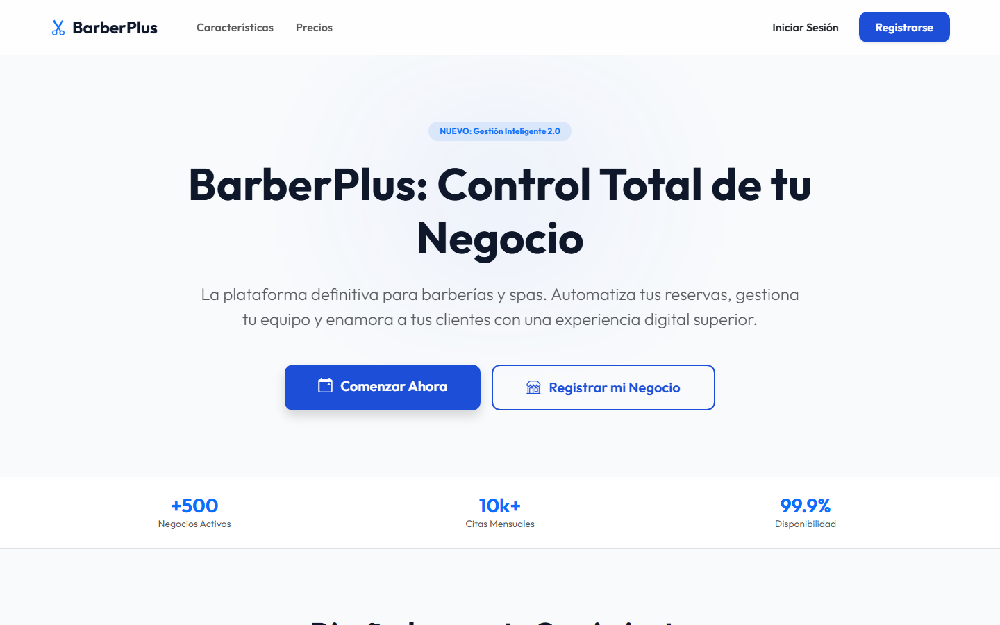
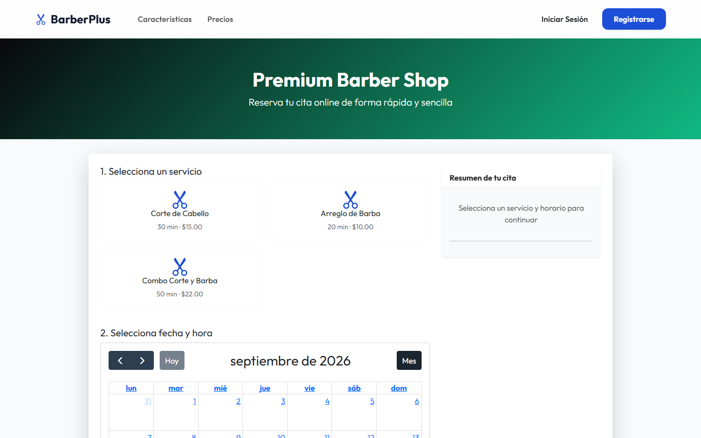
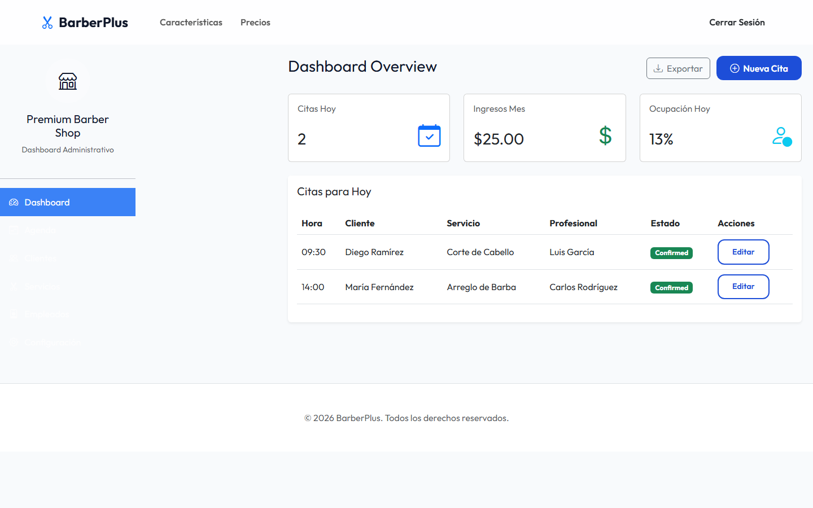
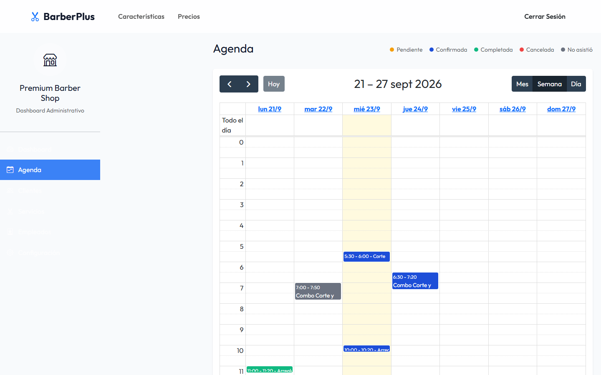

# CitasPlus (BarberPlus)

[](https://laravel.com)
[](https://php.net)
[](https://www.postgresql.org)
[](https://vitejs.dev)
[](https://getbootstrap.com)
[](LICENSE)
[](AGENTS.md#8-known-gaps--inconsistencies)

> **English summary:** CitasPlus is a Laravel 10 + PostgreSQL appointment-booking web app, prototyped around a barbershop use case (generic enough for any appointment-based service business). Public booking flow with real-time slot availability and double-booking prevention, plus a business dashboard/calendar. Stack: Laravel 10, PHP 8.1, PostgreSQL, Vite, Bootstrap 5, FullCalendar. See [Instalación](#instalación) below to run it locally, or [AGENTS.md](AGENTS.md) for the full technical breakdown (architecture, conventions, known gaps).

Prototipo de aplicación web para gestión y reserva de citas online, pensado inicialmente para negocios tipo barbería/peluquería (aunque el modelo de datos es genérico para cualquier negocio de servicios con cita previa).

> Documentación técnica para agentes/desarrolladores (stack, arquitectura, convenciones, deuda técnica conocida): ver [AGENTS.md](AGENTS.md).

## Capturas

| Landing pública | Reserva de cita |
|---|---|
|  |  |

| Dashboard del negocio | Agenda (calendario) |
|---|---|
|  |  |

## Funcionalidades

### Para clientes (reserva pública)
- Página pública de reserva por negocio (`/book/{businessId}`): elegir servicio, empleado y horario disponible.
- Consulta de horarios disponibles en tiempo real, generados en bloques de 30 minutos según el horario del negocio (`business_hours`) y evitando choques con citas ya existentes.
- Confirmación de la cita (creación del registro en `appointments`).
- Registro e inicio de sesión de clientes (`/register`, `/login`).

### Para negocios
- Registro de una cuenta de negocio nueva (`/register`, crea el usuario y su `Business` asociado) e inicio de sesión (`/login`).
- Panel propio (`/business/dashboard`): citas del día, ingresos del mes, tasa de ocupación.
- Agenda visual (`/business/calendar`): todas las citas del negocio en un calendario (FullCalendar), coloreadas por estado (pendiente, confirmada, completada, cancelada, no asistió).
- Modelo de datos preparado (aunque sin UI/lógica completa aún) para:
  - Servicios ofrecidos (`services`) y empleados (`employees`) por negocio.
  - Horarios de atención por día de la semana (`business_hours`) y cierres especiales/feriados (`special_closures`).
  - Pagos por cita (`payments`) — sin integración real con ninguna pasarela de pago.
  - Recordatorios por email/SMS/WhatsApp (`reminders`) — solo modelado en base de datos, sin envío real implementado.

### Loop completo para exhibir

1. Un visitante entra a `/book/1` (negocio demo sembrado), elige servicio, horario y reserva.
2. Se loguea como el negocio (`admin@barberia.com` / `admin`) y ve la cita nueva reflejada al instante en `/business/dashboard` y `/business/calendar`.
3. El seeder ya precarga 8 citas de ejemplo (pasadas, de hoy y futuras, con distintos estados) y 2 pagos completados, para que el panel no arranque vacío.
4. También se puede probar el alta de un negocio nuevo desde cero vía `/register`.

### Estado del proyecto
Es un **prototipo**: algunas piezas (recordatorios, pagos, gestión de servicios/empleados desde el panel) están modeladas en base de datos pero sin UI completa todavía. Ver la sección "Known gaps" de [AGENTS.md](AGENTS.md) para el detalle.

## Requisitos previos

- PHP `^8.1` con Composer
- Node.js + npm
- PostgreSQL (el proyecto está configurado para `pgsql`, no MySQL)
- Extensiones PHP habituales de Laravel (pdo_pgsql, mbstring, openssl, etc.)

## Instalación

```bash
# 1. Instalar dependencias PHP
composer install

# 2. Instalar dependencias JS
npm install

# 3. Configurar variables de entorno
# El repo ya incluye un .env con valores de ejemplo para desarrollo local
# (DB_DATABASE=barberplus, DB_USERNAME=postgres, DB_PASSWORD=...).
# Ajustá DB_PASSWORD según la contraseña real de tu Postgres local antes de continuar.
# Si APP_KEY viniera vacío:
php artisan key:generate

# 4. Crear la base de datos en PostgreSQL (si no existe)
#    createdb barberplus

# 5. Ejecutar migraciones y datos de ejemplo (negocio, empleados, servicios, clientes y citas demo)
php artisan migrate --seed
```

Credenciales del negocio demo sembrado (para loguearse en `/login`): **admin@barberia.com** / **admin**.

> Nota: existe también `database/schema.sql`, un dump manual del esquema equivalente a las migraciones. Usar **una sola vía** (migraciones o el SQL manual) para evitar duplicar/desalinear la base.

## Ejecutar en desarrollo

Se necesitan dos procesos corriendo en paralelo:

```bash
# Servidor de Laravel
php artisan serve

# Compilación de assets (Vite) en modo watch
npm run dev
```

Por defecto la app queda disponible en `http://localhost:8000` (o el puerto que indique `artisan serve`).

## Compilar para producción

```bash
npm run build
```

## Notas adicionales

- No hay suite de tests configurada todavía (PHPUnit está como dependencia pero sin `tests/` ni `phpunit.xml`).
- No hay linter configurado (Laravel Pint está instalado pero sin configuración ni script asociado).
